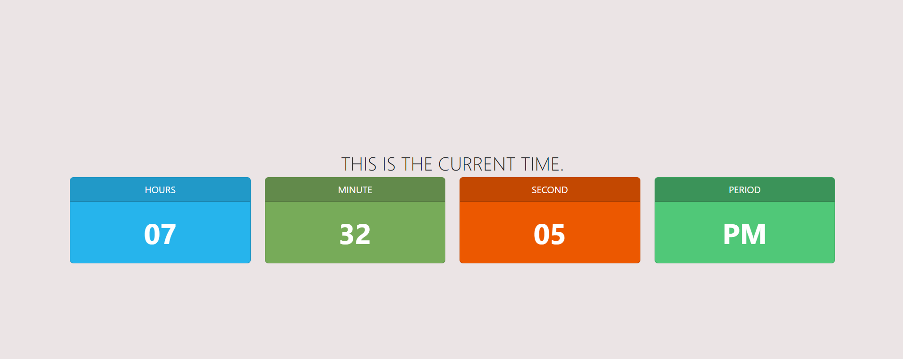

# Digital Clock

This is a simple digital clock web page displaying the current time including hours, minutes, seconds, and period (AM or PM). The time updates every second to reflect the current time accurately.

## Features

- Displays the current time in a digital format.
- Updates the time dynamically every second.
- Uses Bootstrap for styling to create a visually appealing layout.

## Usage

1. Open the HTML file (`index.html`) in a web browser.
2. The current time will be displayed with separate cards for hours, minutes, seconds, and period.
3. Each card updates its content every second to reflect the current time.

## Technologies Used

- HTML
- CSS (Bootstrap)
- JavaScript

## Preview

## Contributing

Pull requests are welcome. For major changes, please open an issue first to discuss what you would like to change.

## License

This project is licensed under the MIT License - see the [LICENSE](LICENSE) file for details.
