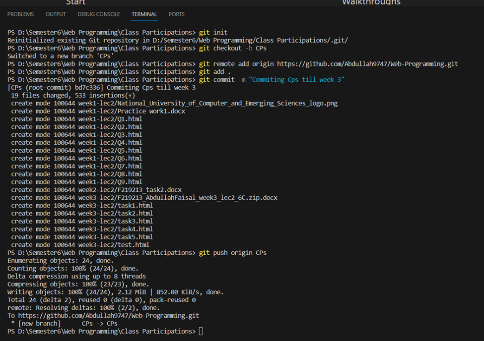
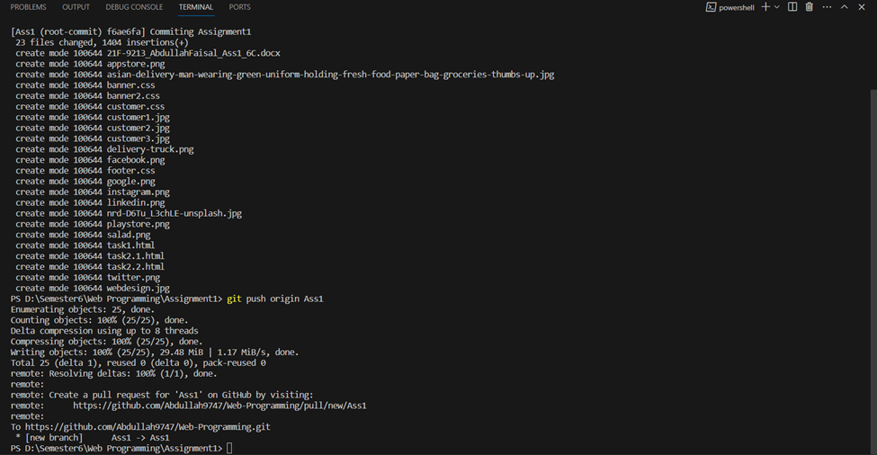
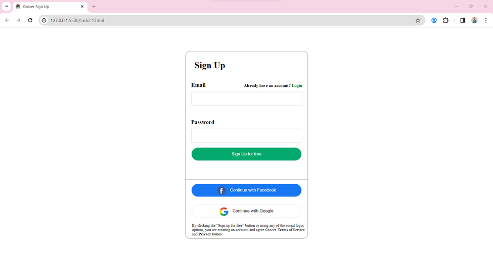
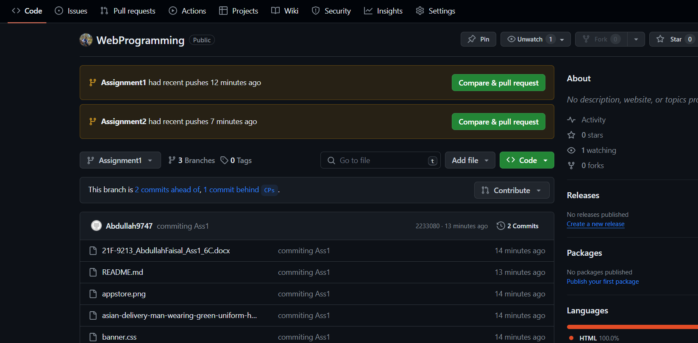

This is my Assignment 1 of my Web programmig Course 
Topics included are : 
.Html
.Css

Task1 : 
  . Created a grocery website using Html and Css.
  . Used media queries to make it responsive.
  . Used Flex box for alignment of items.
  . A signup button which takes you to Signup page.
Task 2:
  . Created a Sign up Page
  . User Just have to enter Email and password to signup.
  . User can also SignUP by his/her Google or Facebook Account.
  . Added privacy Policy at the bottom of Form.
Task 3: 
  . Created a Login  Page
  . User Just have to enter Email and password to Login.
  . User can also Login by his/her Google or Facebook Account.
  . Added Forget Password at the bottom of form.

SS Task 1:

SS Task 2:

SS task3:

