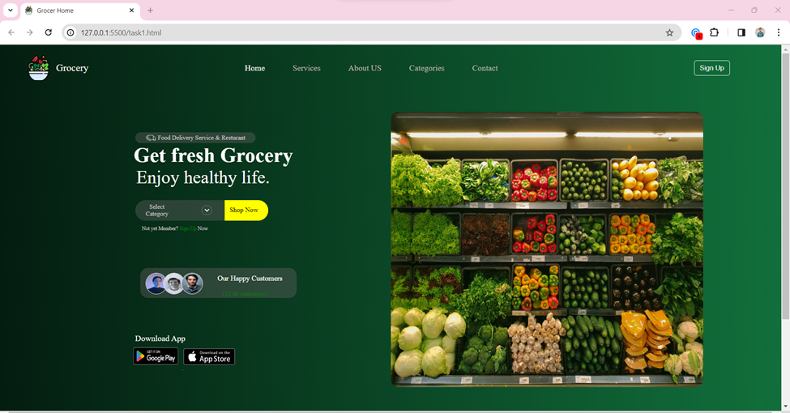
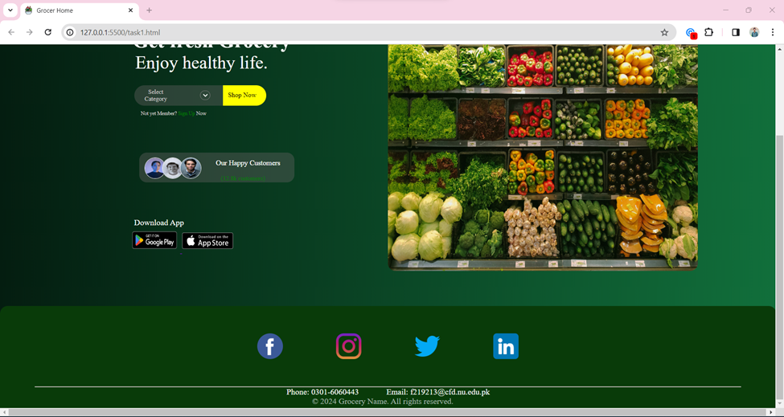
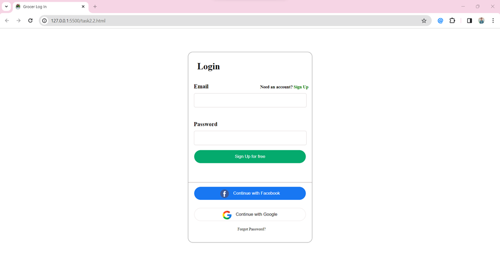
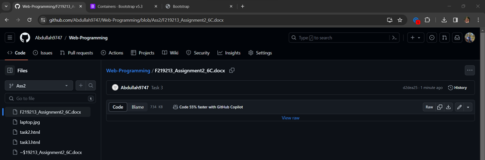

This is my Second Assignment of Web programming.
It has three tasks.
Task1 : Screen shots of git commits to All Cp's and Assignment 1 & 2 in separate branches.
Task2: Created a Signup form and also used validation to each field.
  .Each field is Necessary to Enter
  .Each field has validation implemented in Javascript using patterns(Regex).
Task3: Created a Page using Bootstrap
   .Page is responsive to screen sizes
   .Used container-xxl for my screen size from bootstrap.
   .Container Adapts accordingly sizes mentioned at bootstrap docs.
   .used class="my-4" & class="my-3" for separating lines for each div
SS Task 1 :

SS Task2:

SS Task3:
